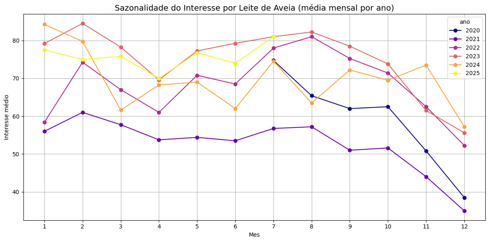

# 📊 Seasonal Interest in Oat Milk in Brazil

## 💼 Business Problem

Companies in the plant-based food sector (such as NotCo, Nestlé, and vegan startups) face difficulties in predicting **when Brazilian consumers show greater interest in products like oat milk**. This directly impacts the planning of **marketing campaigns, stock management, and seasonal product launches**.

---

## 🎯 Project Objective

To perform a predictive and seasonal analysis of Brazilian consumer interest in **oat milk**, based on publicly available Google Trends data, with the goal of:

- **Identifying peak and low interest periods**
- Supporting strategic decisions in marketing, product launches, and inventory planning
- Providing **practical insights for companies in the healthy food sector**

---

## 🔍 Data Sources and References

- **Data Source**: [Google Trends](https://trends.google.com) (exported CSV)
- **Tools**: Google Colab, Python, Pandas, Matplotlib, Seaborn
- **Reference**: [DSA Blog - How to Build an Irresistible Portfolio](https://www.datascienceacademy.com.br/blog)

---

## 🧠 Strategic Insight Extracted

> During **January and February**, interest in oat milk is consistently high. However, in **November and December**, interest drops significantly. This pattern suggests that consumers start the year motivated by goals of lifestyle and dietary changes (“new year, new me”), but tend to lose momentum by the end of the year — reinforcing a common behavioral cycle.

---

## 📈 Seasonal Analysis Chart

---

## 📊 Results Summary

- January and February → **Best months for marketing campaigns**
- November and December → **Lower opportunity for new launches**
- June and July → **Interest varies**, possibly a period of reactivation

---

## 📁 Project Structure

📦 seasonal-oatmilk-interest/
├── data/
│ └── multiTimeline.csv
├── images/
│ └── grafico_sazonalidade.png
├── notebooks/
│ └── 01_oatmilk_seasonal_analysis.ipynb
├── README.md

---

## ✅ Conclusion

This project shows how publicly available data can be strategically used to generate real value for companies. Understanding **consumer behavior over time** allows organizations to make smarter and more profitable decisions.

---

## 👩‍💻 Author

**Emmilly Dias**  
I'm Emmilly Dias, a nutritionist transitioning into Data Analytics and BI.  
My focus is connecting innovation, consumer behavior, and data to help food companies grow smart and sustainably.
[🔗 LinkedIn](https://www.linkedin.com/in/emmilly-dias-silva/)
[🐙 GitHub](https://github.com/your-EmmillyDias/)
